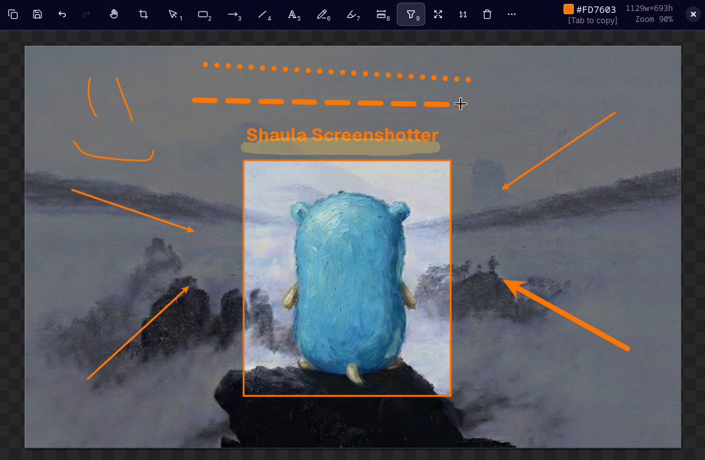

# Shaula

Shaula is a screenshot tool for Wayland/Niri.

Shaula is currently tested primarily on Niri. It also includes integration work
for Noctalia Shell. Broader Wayland compositor support is in progress, but Niri
is the main supported environment right now.

Shaula is screenshot-only. Screen recording, OCR, scrolling capture, and
Share/upload backends are not implemented.



## Installation

Install or update with:

```bash
curl -fsSL https://raw.githubusercontent.com/fgonzalezurriola/shaula/master/scripts/install.sh | sh
```

Install a specific release with:

```bash
curl -fsSL https://raw.githubusercontent.com/fgonzalezurriola/shaula/master/scripts/install.sh | sh -s -- --version v0.1.0
```

For a non-interactive install:

```bash
curl -fsSL https://raw.githubusercontent.com/fgonzalezurriola/shaula/master/scripts/install.sh | sh -s -- --yes
```

Uninstall with:

```bash
curl -fsSL https://raw.githubusercontent.com/fgonzalezurriola/shaula/master/scripts/install.sh | sh -s -- --uninstall
```

## Runtime Requirements

Shaula currently expects Wayland and is tested mainly on Niri. Full support
across GNOME, KDE, Hyprland, Sway, and other Wayland compositors is not promised
yet.

Recommended runtime tools:

- `grim`
- `wl-clipboard` / `wl-copy`
- GTK4 / gtk4-layer-shell runtime libraries

Optional integration tools:

- `slurp`, only if needed as a fallback selection helper
- `niri`, recommended for the best integration
- `quickshell`, only for Noctalia integration

On Arch/CachyOS:

```bash
sudo pacman -S grim wl-clipboard gtk4 gtk4-layer-shell
```

### Niri/Wayland Notes

- Niri is the only supported compositor target for v0.1.x runtime behavior.
- Area selection uses logical compositor/output coordinates; saved PNG
  dimensions, preview dimensions, color sampling, ruler output, and redaction
  edits operate on physical image pixels after output-scale normalization.
- Fractional scaling and multi-output layouts are handled best-effort, but
  Niri IPC/window semantics, Wayland screencopy protocol migration, and overlay
  timing remain technical risk areas.

## Fonts

Shaula uses **Geist** (normal) and **Excalifont** (sketch).

```bash
paru -S ttf-geist ttf-excalifont
```

## Usage

Main usage is tied to the installed Noctalia Shell menu. Shaula can also be
called through the terminal:

```bash
shaula capture quick --json
shaula capture area --json
shaula capture area --json --no-preview
```

Preview supports Copy, Save, Save As, and Done/accept flows. Save and Done use
the configured save folder, defaulting to `~/Pictures/shaula`, and generate
`shaula-screenshot-YYYYMMDD-HHMMSS.png` names from the preview. Direct
no-preview saved captures use `shaula-<mode>-<milliseconds>.png`. The default
fullscreen and all-screens shortcuts save a durable copy to that folder. Pin and
Share are not exposed actions in v0.1.x.

## Development

Requirements:

- Zig 0.16.0
- `jq`
- GTK4 / gtk4-layer-shell development packages
- Wayland development packages

The Zig version is pinned in `.tool-versions`, CI, and
`scripts/qa/check-zig-version.sh`. Use exactly Zig 0.16.0 for release builds
unless the pin is updated everywhere in one change.

Build from source:

```bash
zig build
```

Release build:

```bash
zig build -Doptimize=ReleaseSafe -Dstrip
```

Run checks:

```bash
./dev check
```

Useful development commands:

```bash
./dev capture
./dev noctalia-load
./dev dev-install
```

## Support

<a href="https://ko-fi.com/fgonzalezurriola">
  
</a>

## License

This project is licensed under the MIT License - see the [LICENSE](LICENSE) file for details.

MIT License

Copyright (c) 2026 Fernando González Urriola

Permission is hereby granted, free of charge, to any person obtaining a copy
of this software and associated documentation files (the "Software"), to deal
in the Software without restriction, including without limitation the rights
to use, copy, modify, merge, publish, distribute, sublicense, and/or sell
copies of the Software, and to permit persons to whom the Software is
furnished to do so, subject to the following conditions:

The above copyright notice and this permission notice shall be included in all
copies or substantial portions of the Software.

THE SOFTWARE IS PROVIDED "AS IS", WITHOUT WARRANTY OF ANY KIND, EXPRESS OR
IMPLIED, INCLUDING BUT NOT LIMITED TO THE WARRANTIES OF MERCHANTABILITY,
FITNESS FOR A PARTICULAR PURPOSE AND NONINFRINGEMENT. IN NO EVENT SHALL THE
AUTHORS OR COPYRIGHT HOLDERS BE LIABLE FOR ANY CLAIM, DAMAGES OR OTHER
LIABILITY, WHETHER IN AN ACTION OF CONTRACT, TORT OR OTHERWISE, ARISING FROM,
OUT OF OR IN CONNECTION WITH THE SOFTWARE OR THE USE OR OTHER DEALINGS IN THE
SOFTWARE.
