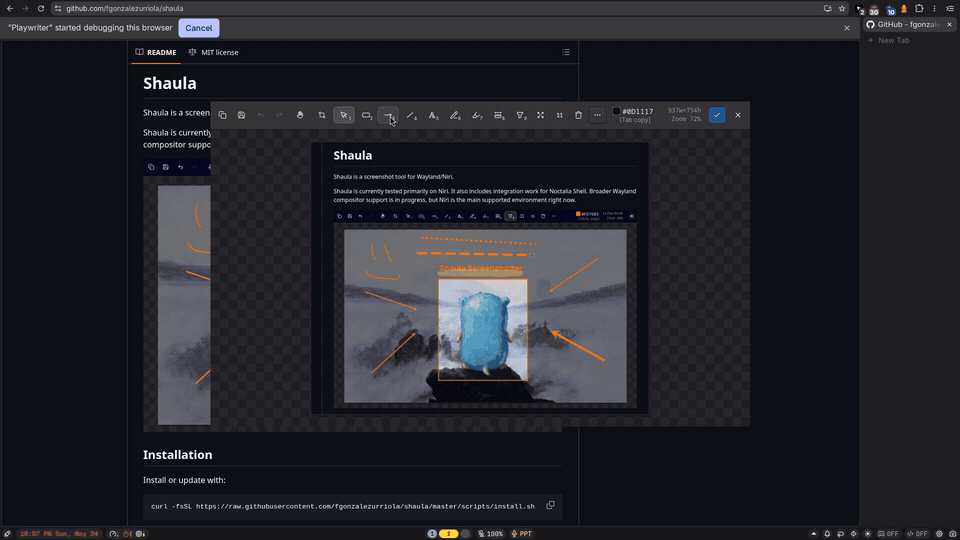

# Shaula

Shaula is a screenshot tool for Wayland/Niri.

Shaula is currently tested primarily on Niri, with integration work for
Noctalia Shell. Broader Wayland compositor support is in progress, but Niri is
the primary supported environment today.

[](docs/assets/demo-readme.mp4)

## Installation

### Arch Linux / CachyOS

```bash
paru -S shaula      # or paru -S shaula-bin 
shaula setup        # configure Niri shortcuts and Noctalia integration
````

Uninstall:

```bash
paru -R shaula
paru -R shaula-bin
```

### Install script

```bash
curl -fsSL https://raw.githubusercontent.com/fgonzalezurriola/shaula/master/scripts/install.sh | sh
```

Uninstall:

```bash
curl -fsSL https://raw.githubusercontent.com/fgonzalezurriola/shaula/master/scripts/install.sh | sh -s -- --uninstall
```

## Manual dependencies

Runtime dependencies:

```bash
sudo pacman -S --needed grim slurp wl-clipboard gtk4 gtk4-layer-shell
```

Optional fonts:

```bash
paru -S ttf-geist ttf-excalifont
```

## Usage

Main usage is through the installed Noctalia Shell menu and keyboard shortcuts
(Ctrl+Shift+1/2/3/4).

Shaula can also be called from the terminal:

```bash
shaula capture quick --json
shaula capture area --json
shaula capture area --json --no-preview
shaula settings --json
shaula explore --json --brief
```

Preview supports Copy, Save, Save As, and Done/accept flows. Save and Done use
the configured save folder, defaulting to `~/Pictures/shaula`, and generate
`YYYYMMDD-HHMMSS.png` names.

Direct no-preview saved captures use the same `YYYYMMDD-HHMMSS.png` template,
adding `-2`, `-3`, and so on when a filename already exists.

The default fullscreen and all-screens shortcuts save a durable copy to the
configured save folder.

## Development

Requirements:

* Zig 0.16.0
* `jq`
* GTK4 / gtk4-layer-shell development packages
* Wayland development packages

The Zig version is pinned in `.tool-versions`, CI, and
`scripts/qa/check-zig-version.sh`. Use exactly Zig 0.16.0 for release builds
unless the pin is updated everywhere in one change.

Build from source:

```bash
zig build
```

Release build:

```bash
zig build -Doptimize=ReleaseSafe -Dstrip
```

Run checks:

```bash
./dev check
```

Useful development commands:

```bash
./dev capture
./dev noctalia-load
./dev dev-install
shaula setup
```

## Support

<a href="https://ko-fi.com/fgonzalezurriola">
  
</a>

## License

MIT License. See [LICENSE](LICENSE).
